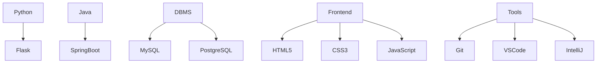

Absolutely, Nikesh! Your current README is already solid—clean, informative, and full of personality. To make it **interactive**, we can add dynamic elements, visual flair, and engaging content that responds to visitors. Here's a leveled-up version of your GitHub README with interactive touches:

---

# 👋 Hi, I'm **Nikesh Singh**  
🚀 *Full Stack Developer* | 💻 *MCA Student* | 🤖 *AI Explorer*  

---

## 🔥 About Me  
```yaml
name: Nikesh Singh
status: MCA Student
skills:
  - Python
  - Java
  - DBMS
interests:
  - Machine Learning
  - Artificial Intelligence
fun_fact: "I debug faster with coffee ☕"
```

---

## 🧠 Currently Learning  
- 📘 Machine Learning algorithms  
- 🧪 AI model tuning  
- 🛠️ Building scalable full-stack apps  

---

## 📌 Featured Project  
### 🤖 [NiCKK-Chatbot](https://github.com/singh-nikesh/NiCKK-Chatbot)  
> A smart chatbot built with Python that learns and adapts.  
> 🧠 NLP | 💬 Interactive UI | 🛠️ Customizable logic  

---

## 🛠️ Tech Stack  


---

## 📊 GitHub Stats  
  


---

## 🧩 Fun Zone  
<details>
  <summary>👀 What I'm watching</summary>
  - *Tech Talks on YouTube*  
  - *AI podcasts*  
  - *Sci-fi series for inspiration*
</details>

<details>
  <summary>🎯 Goals for 2025</summary>
  - Build a production-ready ML app  
  - Contribute to open-source AI projects  
  - Land a full-stack developer role  
</details>

---

## 📫 Connect With Me  
[](https://www.linkedin.com/in/singh-nikesh/)  
[](https://github.com/singh-nikesh)  
[](mailto:singhnikesh020@gmail.com)

---

⭐ *Thanks for visiting! Drop a ⭐ on my projects if you find them cool. Let's build something awesome together.*

---

Would you like me to help you format this into a Markdown file or add even more flair like visitor counters, contribution graphs, or GitHub trophies?
